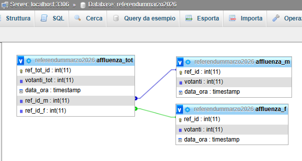
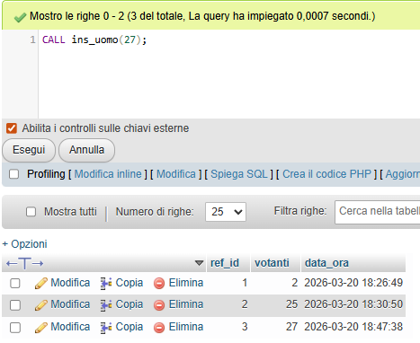
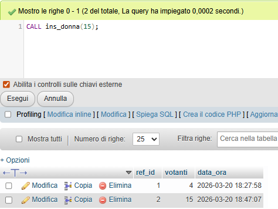
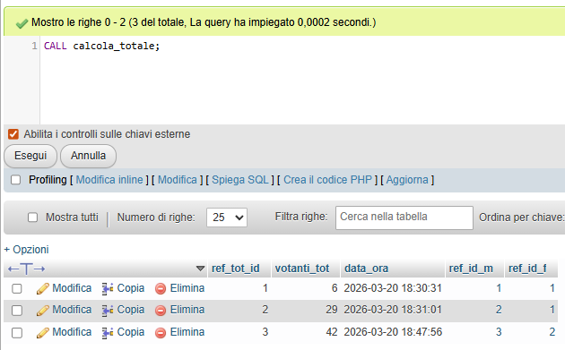

# Affluenza elezioni
### Un semplice database MySQL per tenere d'occhio l'affluenza in un seggio elettorale.<br>

Passo molto mio tempo nei seggi elettorali, quando ve n'è l'occasione.<br>
Capita che, ogni tanto, chi di dovere venga a chiedere i dati riguardanti l'affluenza al seggio.<br>
Al fine di tenere sott'occhio i vari dati e avere un conteggio sotto mano senza carta, né penna, ho designato questo semplice database in MySQL.<br><br>
Il database è composto da tre tabelle: 
1) affluenza_tot per l'affluenza totale;
2) affluenza_m per l'affluenza maschile;
3) affluenza_f per l'affluenza femminile.

Le chiavi primarie ref_id delle tabelle affluenza_m e affluenza_f sono collegate a due chiavi esterne contenute in affluenza_tot.

Il database è strutturato alla seguente maniera:<br>


Personalmente, gestisco i miei database MySQL con MAMP e phpMyAdmin.
____________________________________
Per creare e utilizzare il database:
```

create database referendummarzo2026;
use referendummarzo2026;
```
Per creare le tre tabelle e collegarle tra loro tramite chiavi esterne:
```
create table affluenza_tot(ref_tot_id INT PRIMARY KEY AUTO_INCREMENT, votanti_tot INT, data_ora TIMESTAMP, ref_id_m INT, ref_id_f INT);
create table affluenza_m(ref_id INT PRIMARY KEY AUTO_INCREMENT, votanti INT, data_ora TIMESTAMP);
create table affluenza_f(ref_id INT PRIMARY KEY AUTO_INCREMENT, votanti INT, data_ora TIMESTAMP);
ALTER TABLE affluenza_tot ADD CONSTRAINT ref_id_m FOREIGN KEY(ref_id_m) REFERENCES affluenza_m(ref_id);
ALTER TABLE affluenza_tot ADD CONSTRAINT ref_id_f FOREIGN KEY(ref_id_f) REFERENCES affluenza_f(ref_id);
```
____________________________________

Per inserire manualmente un numero intero nella tabella affluenza_m che rappresenta i votatori di sesso maschile a un certo orario (XX è un numero intero come 1, 10, 22, 34 etc...):
```
insert into affluenza_m(votanti, data_ora) VALUES(XX, NOW());
```
Per creare una procedura memorizzata dell'operazione sovrastante al fine di non riscrivere manualmente l'istruzione:
```
DELIMITER $$
CREATE PROCEDURE ins_uomo(IN womo INT) BEGIN insert into affluenza_m(votanti, data_ora) VALUES(womo, NOW()); END$$
DELIMITER ;
```
Per richiamare la procedura memorizzata per i votatori di sesso maschile:
```
CALL ins_uomo(XX);
```
Di seguito, una dimostrazione dell'inserimento dei dati nella tabella dei votanti di sesso maschile:<br>

____________________________________
Per inserire manualmente un numero intero nella tabella affluenza_f che rappresenta i votatori di sesso femminile  a un certo orario (XX è un numero intero come 1, 10, 22, 34 etc...):
```
insert into affluenza_f(votanti, data_ora) VALUES(XX, NOW());
```
Per creare una procedura memorizzata dell'operazione sovrastante al fine di non riscrivere manualmente l'istruzione:
```
DELIMITER $$
CREATE PROCEDURE ins_donna(IN donai INT) BEGIN insert into affluenza_f(votanti, data_ora) VALUES(donai, NOW()); END$$
DELIMITER ;
```
Per richiamare la procedura memorizzata per i votatori di sesso femminile:
```
CALL ins_donna(XX);
```
Di seguito, una dimostrazione dell'inserimento dei dati nella tabella dei votanti di sesso femminile:<br>

____________________________________
Per calcolare i votanti totali nella tabella affluenza_tot dati i valori massimi presenti nelle tabelle affluenza_m e affluenza_f:
```
INSERT INTO affluenza_tot(ref_id_m,ref_id_f,votanti_tot,data_ora) VALUES((SELECT MAX(ref_id) from affluenza_m),(SELECT MAX(ref_id) from affluenza_f), (SELECT MAX(votanti) FROM affluenza_m) + (SELECT MAX(votanti) FROM affluenza_f), NOW());
```
Per creare una procedura memorizzata dell'operazione sovrastante al fine di non riscrivere manualmente l'istruzione:
```
DELIMITER $$
CREATE PROCEDURE get_customers() BEGIN INSERT INTO affluenza_tot(ref_id_m,ref_id_f,votanti_tot,data_ora) VALUES((SELECT MAX(ref_id) from affluenza_m),(SELECT MAX(ref_id) from affluenza_f), (SELECT MAX(votanti) FROM affluenza_m) + (SELECT MAX(votanti) FROM affluenza_f), NOW()); END$$
DELIMITER ;
```
Per richiamare la procedura memorizzata:
```
CALL calcola_totale();
```
Di seguito, una dimostrazione del calcolo dei votanti totali:<br>

Come si può evincere dallo screenshot, verranno memorizzati in progressione nella tabella votanti_tot:
1) Un progressivo;
2) il numero di votanti totali;
3) la data e l'ora al momento dell'esecuzione del calcolo;
4) il riferimento da cui è tratto il numero massimo dei votanti di sesso maschile;
5) il riferimento da cui è tratto il numero massimo dei votanti di sesso femminile.
____________________________________
